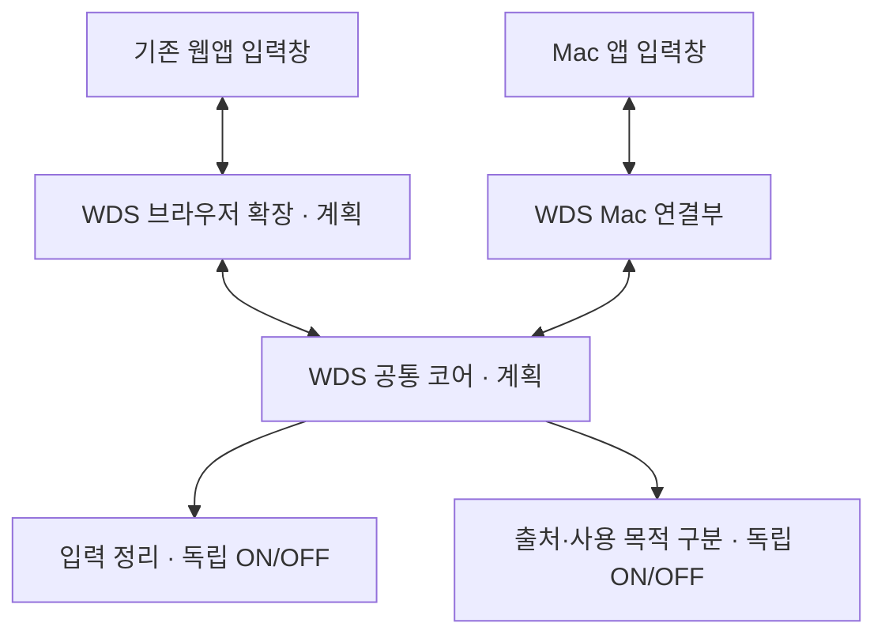

# WDS 제품 방향과 범용화 계획

[제품 소개로 돌아가기](../README.md) · [현재 Mac 구현](macos.md)

> What Did you Say? — Your intent, without the noise.
>
> Clean up your prompts. Keep your instructions distinct from quoted content.

제품 이름은 **WDS — What Did you Say?**입니다. AI에 전달할 내 요청을 정리하고, 외부 의견과의 경계를 보존하는 입력 도구입니다. 현재 Mac 구현과 아래의 목표 구조는 구분합니다. 구현 상태는 [README](../README.md#현재-구현-상태)에 기록합니다.

## 두 기능의 관계

입력 정리는 군더더기 삭제와 제한적인 표기 교정을 제안합니다. 출처 구분은 가져온 내용을 누구의 주장으로, 어떤 용도로 전달할지 보존합니다. 하나를 사용하기 위해 다른 기능까지 켤 필요가 없어야 합니다.

설정과 진행 중인 작업의 취소도 독립적이어야 합니다. 입력 정리를 끄면 초안 감시·교정 제안이 멈추고, 출처 구분만 켠 상태에서는 초안 감시를 시작하지 않고 외부 의견을 가져올 수 있어야 합니다. 이미 표시된 인용 원문은 출처 기능을 끄더라도 정리 대상에서 보호합니다.

## 출처와 사용 목적

AI가 썼는가와 사용자가 그 내용을 요청으로 채택했는가는 서로 다른 정보입니다.

| 상황 | 전달 의미 |
| --- | --- |
| 다른 세션의 의견을 비교·토론 | 검토할 외부 주장. 사용자 의견·동의·승인·실행 지시로 취급하지 않음 |
| AI가 개선한 프롬프트를 검토 중 | 아직 채택하지 않은 제안. 작성 지시를 했다는 사실만으로 결과 전체가 승인되지는 않음 |
| 사용자가 개선본을 실제 요청으로 채택 | 채택한 내용을 사용자 요청으로 전달하면서 AI가 수정했다는 출처는 보존 |

최소한 출처, 사용 목적, 사용자 채택 상태를 별도로 다룹니다. 본문 속 ‘승인됨’ 같은 문장으로 채택 상태를 만들지 않습니다. 명령문 형태라는 이유로 실행할 요청으로 분류하지 않습니다.

현재 Mac 작업 브랜치는 명시적 외부 의견 가져오기와 경계 삽입까지 구현했습니다. 위의 목적·채택 상태 모델은 아직 구현되지 않았습니다.

## 조작 부담을 줄이는 방향

두 기능의 내부 모델을 사용자에게 매번 분류 작업으로 요구하지 않습니다. 평소 복사·붙여넣기를 유지하고, 입력창 주변의 작은 표시로 상태를 확인·수정하는 흐름을 검토합니다.

현재 제안하는 기본 동작은 복사 경로가 확인된 다른 세션의 응답을 검토 자료로 표시하고, 실제 요청으로 채택하는 경우에만 사용자가 목적을 바꾸는 것입니다. 출처나 목적을 확인할 수 없는 텍스트는 임의로 바꾸지 않습니다. 개선본을 옮기는 작업에서도 조작 부담이 줄어드는지는 실제 사용으로 검증해야 합니다.

작은 출처 표시, 자동 복사 출처 전달, 요청으로 채택하는 조작은 **설계안**입니다. 현재 제공하는 메뉴 동작과 혼동하지 않습니다. 출처 구분은 사용자 요청과 외부 자료를 구분하는 보조 수단이며, 모델의 지침 준수를 강제하는 보안 경계라고 주장하지 않습니다.

## 범용화 구조

목표 구조이며, 아래의 공통 코어와 브라우저 확장은 아직 구현되지 않았습니다.

공통 코어는 텍스트와 명시적인 상태를 받아 편집 후보·보호 범위·출처 표현을 반환합니다. DOM, AppKit, 접근성 권한, 화면 좌표, 파일이나 클립보드 접근을 직접 소유하지 않습니다. 브라우저에서 실행 가능한 공통 코드로 정리하고 Mac에서도 같은 판단 로직을 사용하게 연결하는 방향입니다. Mac 실행 경로의 구체적인 연결 방식은 마이그레이션 시 검증합니다.

플랫폼별 연결부는 현재 입력창 읽기, 후보 표시, 사용자 선택, 쓰기 직전 재검증, 정확 구간 편집, 효과 재생을 담당합니다. 브라우저에서는 페이지 안에서, Mac에서는 접근성 API와 네이티브 오버레이로 처리합니다. 공통 코어는 각 기기 안에서 실행하고 중앙 서버로 초안을 보내는 구조를 전제로 하지 않습니다.

브라우저 확장이 제공되더라도 모든 웹 편집기나 네이티브 앱이 자동으로 지원되는 것은 아닙니다. 앱별 입력창 연결과 호환성 검증이 필요하며, Windows 네이티브 앱과 모바일은 별도의 지원 범위입니다.

## 이행 시 지킬 기준

1. 기존 Mac 입력 정리와 Inertbox 문서 처리의 입력·기대 결과를 공통 검증 자료로 먼저 보존합니다.
2. 운영체제에 의존하지 않는 판단·표현 로직을 추출합니다. 예전 웹 실험판을 현재 규칙의 검증된 구현으로 간주하지 않습니다.
3. 브라우저와 Mac 연결부가 같은 텍스트에서 같은 후보·보호 범위를 얻는지 검사합니다. 한국어 조합 입력과 UTF-16 범위, 포커스·초안 변경 시 편집 취소를 검증합니다.
4. 기존 입력창에서 읽기·승인·편집·효과까지 실제로 확인한 환경만 지원 범위로 기록합니다.
5. 구현한 기능은 기본 브랜치·작업 브랜치·배포판 중 어디에 있는지 함께 표시합니다.

Inertbox의 독립 제품을 다시 만드는 대신 작업물을 WDS의 범용 출처 구분 기능으로 이어가는 것이 현재 방향입니다.
